# Chhath Radio — Comprehensive Code Review

**Date:** 2026-08-13  
**Scope:** Security · Performance · Code Quality  
**Reviewer:** Lyzo (Project Planner)

---

## Executive Summary

The codebase is well-structured with clear separation of concerns, good use of Pydantic validation, and thoughtful Redis-backed presence/caching design. However, there are **critical security issues** (weak default secret key, no rate limiting, session_id injection via SSE), **performance risks** (synchronous Redis calls in async context, SSE counter drift, DB connection not rolled back on error), and **quality gaps** (type inconsistency in `get_radio_queue`, import inside loop, missing CORS env var on frontend, docker-compose healthcheck wrong path). The user also specifically requested that **both FE and BE support all-origins CORS via `.env` only** — this is currently only half-implemented.

---

## 1. Security Issues

### 1.1 🔴 CRITICAL — Weak Default `SECRET_KEY`

**File:** [`backend/app/core/config.py:13`](backend/app/core/config.py:13)

```python
SECRET_KEY: str = Field(default="change-me-in-production-use-a-long-random-string")
```

The default value is a known, predictable string. If a developer forgets to set `SECRET_KEY` in `.env`, all JWTs are signed with this key — any attacker who reads the source code can forge admin tokens.

**Fix:** Remove the default entirely and make it a required field with no fallback:
```python
SECRET_KEY: str = Field(..., min_length=32)
```
This forces a startup crash if not set, which is far safer than silently using a weak key.

---

### 1.2 🔴 CRITICAL — No Rate Limiting on Login or Heartbeat Endpoints

**Files:** [`backend/app/api/admin/auth.py:17`](backend/app/api/admin/auth.py:17), [`backend/app/api/presence.py:13`](backend/app/api/presence.py:13)

The `/api/admin/login` endpoint has no brute-force protection. An attacker can attempt unlimited password guesses. Similarly, `/api/presence/heartbeat` accepts any `session_id` with no throttle, enabling listener count inflation.

**Fix:** Add `slowapi` (FastAPI-native rate limiter) middleware:
```python
# In main.py
from slowapi import Limiter, _rate_limit_exceeded_handler
from slowapi.util import get_remote_address
limiter = Limiter(key_func=get_remote_address)
app.state.limiter = limiter
app.add_exception_handler(RateLimitExceeded, _rate_limit_exceeded_handler)

# On login route
@router.post("/login")
@limiter.limit("5/minute")
def admin_login(request: Request, body: AdminLogin, ...):
```

---

### 1.3 🟠 HIGH — SSE `session_id` Not Validated — Listener Count Inflation

**File:** [`backend/app/api/events.py:116`](backend/app/api/events.py:116)

```python
session_id: str = Query(..., description="Unique anonymous session ID (UUID)")
```

The `session_id` is accepted as a raw string with no UUID format validation. A malicious client can open thousands of SSE connections with unique fake session IDs, inflating the listener count to any number. There is also no cap on concurrent SSE connections per IP.

**Fix:** Validate UUID format in the query parameter:
```python
import uuid
session_id: uuid.UUID = Query(..., description="Unique anonymous session ID (UUID)")
```
And convert to string when passing to the service: `str(session_id)`.

---

### 1.4 🟠 HIGH — Docker Compose Exposes DB and Redis Ports in Production

**File:** [`docker-compose.yml:43-44`](docker-compose.yml:43), [`docker-compose.yml:67-68`](docker-compose.yml:67)

```yaml
ports:
  - "5432:5432"  # PostgreSQL exposed to host
  - "6379:6379"  # Redis exposed to host
```

The comment says "Expose only in local dev; remove port mapping in production" but there is no mechanism to enforce this. A production deployment using this file as-is exposes the database and Redis to the internet.

**Fix:** Use a separate `docker-compose.prod.yml` override that removes these port mappings, or use Docker Compose profiles to gate them:
```yaml
db:
  ports:
    - target: 5432
      published: 5432
      mode: host  # only bind if explicitly overridden
```

---

### 1.5 🟠 HIGH — CORS: Frontend Has No `.env`-Driven CORS Control (User's Specific Request)

**Files:** [`frontend/next.config.ts:55`](frontend/next.config.ts:55), [`backend/app/main.py:36-43`](backend/app/main.py:36)

The backend correctly reads `CORS_ORIGINS` from `.env`. However, the frontend's `Content-Security-Policy` `connect-src` directive is hardcoded to `'self'` with only an optional `NEXT_PUBLIC_EXTRA_CONNECT_SRC` addendum. There is no single `.env` variable that controls "allow all origins" for the frontend CSP.

Additionally, the frontend's `docker-compose.yml` service sets `NEXT_PUBLIC_API_BASE: http://localhost:8000` hardcoded — not from `.env`.

**Fix (per user's request):** Add a `NEXT_PUBLIC_CORS_ALLOW_ALL` env var (or reuse `CORS_ORIGINS=*`) that, when set to `*`, sets `connect-src *` in the CSP. Both FE and BE should read from the same `.env` file pattern.

---

### 1.6 🟡 MEDIUM — JWT Token Has No `iat` (Issued-At) Claim

**File:** [`backend/app/auth/security.py:40`](backend/app/auth/security.py:40)

```python
payload = {"sub": str(subject), "exp": expire}
```

Without an `iat` claim, there is no way to implement token revocation by invalidating tokens issued before a certain time (e.g., after a password change). This is a standard JWT best practice.

**Fix:**
```python
payload = {"sub": str(subject), "exp": expire, "iat": datetime.now(timezone.utc)}
```

---

### 1.7 🟡 MEDIUM — Admin Password Logged/Seeded in Plaintext via Environment Variable

**File:** [`backend/.env.example:25`](backend/.env.example:25), [`backend/seed_admin.py`](backend/seed_admin.py)

`ADMIN_PASSWORD` is passed as a plain environment variable. While this is common for seeding, the password is visible in `docker inspect`, process listings, and shell history.

**Fix:** Document this risk clearly and recommend using Docker secrets or a secrets manager for production. At minimum, clear the env var after seeding.

---

## 2. Performance Issues

### 2.1 🔴 CRITICAL — Synchronous Redis Calls Inside Async SSE Generator

**File:** [`backend/app/api/events.py:78-81`](backend/app/api/events.py:78), [`backend/app/services/presence_service.py:86-121`](backend/app/services/presence_service.py:86)

```python
# In async _sse_stream():
record_heartbeat(session_id)   # synchronous Redis call
count = get_listener_count()   # synchronous Redis call
```

`record_heartbeat` and `get_listener_count` are synchronous functions that make blocking Redis I/O calls. When called from an `async` generator, they block the entire event loop for the duration of the Redis round-trip. Under load with many SSE connections, this will cause severe latency spikes across all concurrent requests.

**Fix:** Either use `asyncio.to_thread()` to offload the blocking calls, or migrate `presence_service.py` to use `redis.asyncio` (the async Redis client):
```python
# Option A: wrap in thread
await asyncio.to_thread(record_heartbeat, session_id)
count = await asyncio.to_thread(get_listener_count)

# Option B (preferred): use async redis client
import redis.asyncio as aioredis
```

---

### 2.2 🟠 HIGH — `import random` Inside Hot Loop

**File:** [`backend/app/services/presence_service.py:115`](backend/app/services/presence_service.py:115)

```python
import random
if random.random() < 0.05:
```

`import random` is called on every heartbeat inside the hot path. Python caches module imports so this is not catastrophically slow, but it is a code smell and adds unnecessary overhead. Move the import to the top of the file.

---

### 2.3 🟠 HIGH — `get_radio_queue` Returns Inconsistent Types (Dict vs ORM Object)

**File:** [`backend/app/services/song_service.py:157-181`](backend/app/services/song_service.py:157)

```python
def get_radio_queue(db: Session) -> list[Song]:
    cached = _cache_get(QUEUE_CACHE_KEY)
    if cached is not None:
        return cached  # type: ignore[return-value]  ← returns list[dict]
    songs = SongService.get_all_enabled(db)
    ...
    return songs  # ← returns list[Song] ORM objects
```

The function's return type is `list[Song]` but on cache hit it returns `list[dict]`. The `# type: ignore` comment acknowledges this. This is a latent bug: any caller that accesses ORM-specific attributes (e.g., relationships) on a cache-hit result will get an `AttributeError` at runtime.

**Fix:** Define a `SongDict` TypedDict and return `list[SongDict | Song]`, or better, always deserialize the cache into `SongPublic` Pydantic models so the return type is consistent:
```python
def get_radio_queue(db: Session) -> list[dict]:
    cached = _cache_get(QUEUE_CACHE_KEY)
    if cached is not None:
        return cached
    songs = SongService.get_all_enabled(db)
    result = [_song_to_dict(s) for s in songs]
    _cache_set(QUEUE_CACHE_KEY, result, QUEUE_CACHE_TTL)
    return result
```

---

### 2.4 🟠 HIGH — Database Session Not Rolled Back on Exception

**File:** [`backend/app/db/database.py:24-33`](backend/app/db/database.py:24)

```python
def get_db():
    db = SessionLocal()
    try:
        yield db
    finally:
        db.close()
```

If an unhandled exception occurs during a request (e.g., a DB constraint violation that isn't caught), the session is closed but not rolled back. SQLAlchemy will roll back on `close()` if there's an active transaction, but this is implicit and can leave the connection pool in a dirty state under certain drivers.

**Fix:** Add explicit rollback on exception:
```python
def get_db():
    db = SessionLocal()
    try:
        yield db
    except Exception:
        db.rollback()
        raise
    finally:
        db.close()
```

---

### 2.5 🟡 MEDIUM — SSE Counter Can Drift Under Multi-Worker Gunicorn

**File:** [`backend/app/services/presence_service.py:104-111`](backend/app/services/presence_service.py:104)

The `COUNTER_KEY` (Redis INCR/DECR) is maintained alongside the sorted set `SESSIONS_KEY`. The `get_listener_count()` function correctly uses `zcount` (the sorted set) rather than the counter, which is good. However, `remove_session` still decrements `COUNTER_KEY` even though `get_listener_count` doesn't use it. This creates dead code that can drift negative and cause unnecessary Redis writes.

**Fix:** Remove all `INCR`/`DECR` operations on `COUNTER_KEY` since `get_listener_count` already uses `zcount` for accuracy. The counter key is redundant.

---

### 2.6 🟡 MEDIUM — `preload_app = True` Conflicts with SSE Long-Lived Connections

**File:** [`backend/gunicorn.conf.py:62`](backend/gunicorn.conf.py:62)

`preload_app = True` loads the app before forking workers. This is good for memory (copy-on-write), but the Redis connection pool created at module load time in `presence_service.py` (via `@lru_cache`) will be shared across the fork boundary. Redis connections are not fork-safe — child processes may share file descriptors, causing connection corruption.

**Fix:** Either set `preload_app = False`, or use a `post_fork` hook to reset the Redis pool:
```python
def post_fork(server, worker):
    from app.services.presence_service import _get_pool
    _get_pool.cache_clear()
```

---

### 2.7 🟡 MEDIUM — Docker Compose Backend Healthcheck Uses Wrong Path

**File:** [`docker-compose.yml:96`](docker-compose.yml:96)

```yaml
test: ["CMD", "curl", "-f", "http://localhost:8000/health"]
```

The actual health endpoint is registered at `/api/health` (see [`backend/app/main.py:66`](backend/app/main.py:66)), not `/health`. This means the healthcheck always fails, and `depends_on: condition: service_healthy` for the frontend will never be satisfied.

**Fix:**
```yaml
test: ["CMD", "curl", "-f", "http://localhost:8000/api/health"]
```

---

## 3. Code Quality Issues

### 3.1 🟠 HIGH — `song_service.py` Imports Private Function from Another Service

**File:** [`backend/app/services/song_service.py:21`](backend/app/services/song_service.py:21)

```python
from app.services.presence_service import _get_client as _get_redis
```

`song_service` imports the private `_get_client` function from `presence_service` to reuse the Redis connection pool. This creates tight coupling between two unrelated services and violates the single-responsibility principle. If `presence_service` changes its internal Redis client management, `song_service` silently breaks.

**Fix:** Extract a shared `redis_client.py` module that both services import from:
```python
# backend/app/services/redis_client.py
from functools import lru_cache
import redis
from app.core.config import settings

@lru_cache(maxsize=1)
def get_redis_pool(): ...

def get_redis_client(): ...
```

---

### 3.2 🟠 HIGH — `radio-store.ts` Leaks Adapter Subscriptions

**File:** [`frontend/lib/radio-store.ts:98-104`](frontend/lib/radio-store.ts:98)

```typescript
const unsubscribe = adapter.onStateChange((state) => {
  get().handleAdapterStateChange(state, newSessionId);
});
// Store the unsubscribe function so it can be called on cleanup
(adapter as unknown as { _unsubscribe?: () => void })._unsubscribe = unsubscribe;
```

The `unsubscribe` function is stored on the adapter instance via a type-unsafe cast (`as unknown as`). When `loadQueue` is called again (e.g., switching channels), the previous adapter's subscription is never cleaned up — the old `onStateChange` callback continues to fire, causing ghost state updates. The new session ID guard mitigates this partially, but the old listener still runs on every player event.

**Fix:** Store the unsubscribe function in the Zustand state and call it before loading a new queue:
```typescript
interface RadioState {
  _unsubscribe: (() => void) | null;
  ...
}

loadQueue: async (songs, adapter) => {
  const { _unsubscribe } = get();
  if (_unsubscribe) _unsubscribe();  // clean up previous subscription
  ...
  set({ ..., _unsubscribe: unsubscribe });
}
```

---

### 3.3 🟡 MEDIUM — `startPlayback` Uses `setTimeout` for Buffering Nudge (Race Condition)

**File:** [`frontend/lib/radio-store.ts:126-131`](frontend/lib/radio-store.ts:126)

```typescript
setTimeout(async () => {
  const state = get();
  if (state.playState === "BUFFERING") {
    try { await adapter.play(); } catch { /* ignore */ }
  }
}, 1500);
```

This `setTimeout` fires 1.5 seconds after `loadVideo` regardless of whether the session has changed. If the user skips to the next song within 1.5 seconds, the timeout fires and calls `adapter.play()` on the new song's adapter state, potentially double-playing or causing unexpected behavior. The session guard in `handleAdapterStateChange` doesn't protect this path.

**Fix:** Capture the session ID at the time of the timeout and bail if it has changed:
```typescript
const sessionAtLoad = newSessionId;
setTimeout(async () => {
  if (get().radioSessionId !== sessionAtLoad) return;
  if (get().playState === "BUFFERING") {
    try { await adapter.play(); } catch { /* ignore */ }
  }
}, 1500);
```

---

### 3.4 🟡 MEDIUM — `next.config.ts` CSP Uses `unsafe-eval` and `unsafe-inline`

**File:** [`frontend/next.config.ts:49`](frontend/next.config.ts:49)

```typescript
"script-src 'self' 'unsafe-eval' 'unsafe-inline' https://www.youtube.com ..."
```

`'unsafe-eval'` allows `eval()` and `new Function()` — this is required by Next.js dev mode but should be removed in production builds. `'unsafe-inline'` allows inline scripts, which defeats XSS protection.

**Fix:** Use a nonce-based CSP in production. Next.js 13+ supports middleware-based nonce injection. At minimum, document that `unsafe-eval` must be removed for production and add a build-time check.

---

### 3.5 🟡 MEDIUM — `SongCreate.youtube_video_id` is a `@property` on a Pydantic Model

**File:** [`backend/app/schemas/song.py:46-48`](backend/app/schemas/song.py:46)

```python
@property
def youtube_video_id(self) -> str:
    return extract_youtube_video_id(self.youtube_url) or ""
```

Pydantic v2 does not serialize `@property` attributes — they are invisible to `.model_dump()` and JSON serialization. This property is only used internally in the service layer, but it's misleading to have it on a schema class. The service layer calls `extract_youtube_video_id(data.youtube_url)` directly anyway, making this property dead code.

**Fix:** Remove the `@property` from `SongCreate` and rely solely on the service-layer call.

---

### 3.6 🟡 MEDIUM — `_mem_sessions` Dict Is Not Thread-Safe

**File:** [`backend/app/services/presence_service.py:69-81`](backend/app/services/presence_service.py:69)

```python
_mem_sessions: dict[str, float] = {}

def _mem_count() -> int:
    expired = [sid for sid, exp in _mem_sessions.items() if exp < now]
    for sid in expired:
        del _mem_sessions[sid]
```

The in-memory fallback mutates a module-level dict during iteration. Under Gunicorn with multiple threads (even with `threads=1`, uvicorn workers use asyncio), concurrent coroutines can cause `RuntimeError: dictionary changed size during iteration`.

**Fix:** Use `dict.copy()` before iterating, or use a `threading.Lock`:
```python
def _mem_count() -> int:
    now = time.time()
    expired = [sid for sid, exp in list(_mem_sessions.items()) if exp < now]
    for sid in expired:
        _mem_sessions.pop(sid, None)
    return len(_mem_sessions)
```

---

### 3.7 🟢 LOW — `ACCESS_TOKEN_EXPIRE_MINUTES` Default is 24 Hours

**File:** [`backend/app/core/config.py:15`](backend/app/core/config.py:15)

```python
ACCESS_TOKEN_EXPIRE_MINUTES: int = 60 * 24  # 24 hours
```

24-hour admin tokens with no refresh mechanism means a stolen token is valid for a full day. There is no token revocation mechanism.

**Fix:** Reduce to 4–8 hours for admin tokens, and document the trade-off. Consider adding a token blacklist in Redis for logout support.

---

### 3.8 🟢 LOW — `docker-compose.yml` Frontend Service Missing `BACKEND_URL`

**File:** [`docker-compose.yml:116-118`](docker-compose.yml:116)

```yaml
environment:
  NEXT_PUBLIC_API_BASE: http://localhost:8000
  NEXT_PUBLIC_SITE_URL: http://localhost:3000
```

The frontend service is missing `BACKEND_URL` (used by `next.config.ts` for server-side rewrites). Without it, Next.js rewrites will proxy to `http://localhost:8000` from inside the container — which resolves to the container itself, not the backend service.

**Fix:**
```yaml
environment:
  BACKEND_URL: http://chhath_backend:8000
  NEXT_PUBLIC_API_BASE: http://localhost:8000
  NEXT_PUBLIC_SITE_URL: http://localhost:3000
```

---

## 4. CORS Fix Plan (User's Specific Request)

The user wants **both FE and BE to support all-origins CORS via `.env` only**.

### Current State
- **Backend:** ✅ Already reads `CORS_ORIGINS` from `.env`. `CORS_ORIGINS=*` works.
- **Frontend CSP:** ❌ `connect-src` is hardcoded to `'self'`. Requires `NEXT_PUBLIC_EXTRA_CONNECT_SRC` for additional origins, but there's no `*` mode.
- **Frontend Docker:** ❌ `BACKEND_URL` is missing from the compose service.

### Proposed Fix

Add `NEXT_PUBLIC_CORS_ORIGINS` to the frontend `.env`:

```env
# frontend/.env.local
NEXT_PUBLIC_CORS_ORIGINS=*
```

In [`frontend/next.config.ts`](frontend/next.config.ts), read this variable:

```typescript
const CORS_ORIGINS = process.env.NEXT_PUBLIC_CORS_ORIGINS ?? "";
const connectSrc = CORS_ORIGINS === "*"
  ? "connect-src *"
  : `connect-src 'self'${CORS_ORIGINS ? ` ${CORS_ORIGINS}` : ""}`;
```

This gives a single `.env` knob for both FE and BE CORS behavior.

---

## 5. Implementation Plan

```mermaid
graph TD
    A[Start] --> B[P0: Critical Security]
    B --> B1[Remove SECRET_KEY default]
    B --> B2[Add rate limiting to /login]
    B --> B3[Validate session_id as UUID in SSE]
    B --> B4[Fix healthcheck path /api/health]

    A --> C[P1: CORS via .env only]
    C --> C1[Add NEXT_PUBLIC_CORS_ORIGINS to next.config.ts]
    C --> C2[Add BACKEND_URL to docker-compose frontend service]
    C --> C3[Update .env.example for both FE and BE]

    A --> D[P2: Performance]
    D --> D1[Wrap sync Redis calls in asyncio.to_thread]
    D --> D2[Move import random to top of file]
    D --> D3[Fix get_radio_queue return type consistency]
    D --> D4[Add db.rollback on exception in get_db]
    D --> D5[Add post_fork hook to reset Redis pool]
    D --> D6[Remove dead COUNTER_KEY INCR/DECR]

    A --> E[P3: Code Quality]
    E --> E1[Extract shared redis_client.py module]
    E --> E2[Fix adapter subscription leak in radio-store.ts]
    E --> E3[Add session guard to setTimeout nudge]
    E --> E4[Fix _mem_sessions dict iteration safety]
    E --> E5[Remove dead SongCreate.youtube_video_id property]
    E --> E6[Remove DB/Redis port exposure in prod compose]
```



### Priority Breakdown

| Priority | Issue | File | Effort |
|----------|-------|------|--------|
| P0 | Remove `SECRET_KEY` default | `config.py` | 5 min |
| P0 | Add rate limiting to `/login` | `main.py`, `auth.py` | 30 min |
| P0 | Validate `session_id` as UUID | `events.py` | 10 min |
| P0 | Fix healthcheck path | `docker-compose.yml` | 2 min |
| P1 | CORS via `.env` for frontend | `next.config.ts`, `.env.example` | 20 min |
| P1 | Add `BACKEND_URL` to compose | `docker-compose.yml` | 5 min |
| P2 | Async Redis in SSE | `events.py`, `presence_service.py` | 45 min |
| P2 | Fix `get_radio_queue` type | `song_service.py` | 15 min |
| P2 | `get_db` rollback on error | `database.py` | 5 min |
| P2 | `post_fork` Redis pool reset | `gunicorn.conf.py` | 10 min |
| P2 | Move `import random` | `presence_service.py` | 2 min |
| P3 | Extract `redis_client.py` | new file | 20 min |
| P3 | Fix adapter subscription leak | `radio-store.ts` | 15 min |
| P3 | Session guard in `setTimeout` | `radio-store.ts` | 5 min |
| P3 | Fix `_mem_sessions` iteration | `presence_service.py` | 5 min |
| P3 | Remove dead `@property` | `schemas/song.py` | 2 min |

**Total estimated effort:** ~3 hours for all fixes.

---

## 6. What's Done Well

- JWT auth flow is clean: `HTTPBearer(auto_error=False)` correctly returns 401 (not 403) on missing token.
- Pydantic v2 validation on all schemas with proper field constraints.
- Redis connection pool is correctly shared via `@lru_cache(maxsize=1)` — one pool per process.
- SSE session guard (`radioSessionId`) in the frontend store correctly prevents stale event processing.
- `preload_app = True` + `max_requests` jitter in Gunicorn is a solid production configuration (modulo the fork-safety issue noted above).
- `pool_pre_ping=True` on the SQLAlchemy engine prevents stale connection errors.
- The `zcount`-based listener count is accurate and O(log N) — much better than scanning all keys.
- `QUEUE_CACHE_TTL = 30s` with explicit invalidation on write is a correct cache invalidation strategy.