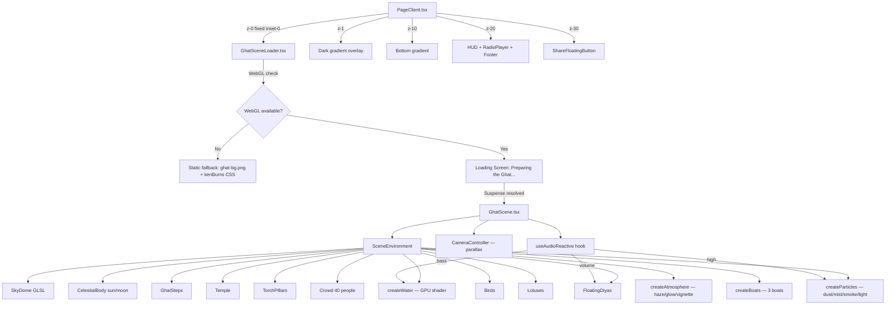

# Chhath Radio — Cinematic 3D Ghat: Full Implementation Plan

> **Mode:** Project Planner → switch to Code mode to implement.
> **Scope:** All 13 steps to upgrade the static `ghat-bg.png` background to a fully immersive Three.js / React Three Fiber 3D Chhath Puja environment, including GLB placeholder generation, GPU water shaders, particle systems, music reactivity, loading screen, WebGL fallback, and `prefers-reduced-motion` support.

---

## Context Snapshot

| Item | Current State |
|---|---|
| [`GhatScene.tsx`](frontend/components/ghat/GhatScene.tsx) | 850-line R3F scene — solid foundation, CPU water, no audio reactivity |
| [`GhatSceneLoader.tsx`](frontend/components/ghat/GhatSceneLoader.tsx) | Minimal dynamic wrapper — not yet mounted in PageClient |
| [`PageClient.tsx`](frontend/components/radio/PageClient.tsx) | Still uses `ghat-bg.png` + Ken Burns + `GeometricBg` at z-0/z-5 |
| `public/chhath/` | Does not exist yet |
| GLB models | None — will be generated as minimal valid placeholders |
| npm deps | `three`, `@react-three/fiber`, `@react-three/drei` already installed |

---

## Architecture Diagram



---

## Step 0 — GLB Placeholder Generator

**File:** [`scripts/generate-glb-placeholders.js`](scripts/generate-glb-placeholders.js)

Since no real Chhath-specific GLB models exist as free downloads, we generate **minimal valid GLB files** (a single triangle mesh, ~200 bytes each) for every path in the asset manifest. This lets `useGLTF` load without 404 errors while the scene uses procedural geometry as the actual visual. When real artist-made GLBs are available, drop them in `public/chhath/models/` and they replace the placeholders automatically.

**Script logic:**
```js
// Writes a binary GLB with a single triangle — valid GLTF 2.0 spec
// Uses only Node.js built-ins (fs, path) — no npm install needed
const models = [
  'woman_arghya', 'woman_soop', 'man',
  'diya', 'basket', 'sugarcane', 'coconut', 'banana',
  'thekua', 'marigold', 'kalash',
  'temple', 'boat', 'ghats', 'banana_plant'
];
// For each: write public/chhath/models/{name}.glb
```

Run with: `node scripts/generate-glb-placeholders.js`

---

## Step 1 — PageClient.tsx Integration

**File:** [`frontend/components/radio/PageClient.tsx`](frontend/components/radio/PageClient.tsx)

**Remove:**
- The `ghat-bg.png` background `<div>` (Layer 0, lines 78–87)
- The `<style>` block with `@keyframes kenBurns` (lines 88–96)
- `import GeometricBg` and `<GeometricBg />` (Layer 5, line 108)

**Add:**
- `import GhatSceneLoader from "@/components/ghat/GhatSceneLoader"`
- `<GhatSceneLoader audioNode={audioNode} />` at z-0

**audioNode threading:** `PageClient` will hold a `audioNodeRef` (passed down from `RadioPlayer` via a callback prop or context). If `RadioPlayer` doesn't expose an `AudioNode` yet, `audioNode={null}` is safe — the scene animates beautifully at neutral values.

**New z-index stack:**
```
z-0   GhatSceneLoader (Three.js canvas, fixed inset-0, pointer-events-none)
z-1   Dark gradient overlay (keep)
z-10  Bottom gradient (keep)
z-20  HUD, player, footer (keep)
z-30  ShareFloatingButton (keep)
z-100 TuneInSplash (keep)
```

---

## Step 2 — GPU Water Shader Component

**File:** [`frontend/components/ghat/scene/createWater.tsx`](frontend/components/ghat/scene/createWater.tsx)

Replaces the CPU vertex-displacement [`River`](frontend/components/ghat/GhatScene.tsx:250) component with a `ShaderMaterial` plane. Zero CPU per-frame allocation.

**Props interface:**
```typescript
interface WaterProps {
  config: TODConfig;
  audioBands: React.MutableRefObject<AudioBands>;
  prefersReduced: boolean;
  isMobile: boolean;
}
```

**Uniforms:**
- `uTime` — driven by `useFrame` delta accumulator
- `uWaveStrength` — default 0.12, bass-reactive (±30%)
- `uReflectionStrength` — 0.4
- `uSunPosition` — from TODConfig
- `uWaterColor` / `uDeepColor` — from TODConfig
- `uFoamThreshold` — 0.08

**Geometry:** `PlaneGeometry(60, 30, 64, 32)` desktop / `(60, 30, 32, 16)` mobile, rotated `-Math.PI/2`.

---

## Step 3 — GLSL Shaders

**Files:**
- [`frontend/components/ghat/shaders/water.vert.glsl`](frontend/components/ghat/shaders/water.vert.glsl)
- [`frontend/components/ghat/shaders/water.frag.glsl`](frontend/components/ghat/shaders/water.frag.glsl)
- [`frontend/components/ghat/shaders/sunGlow.frag.glsl`](frontend/components/ghat/shaders/sunGlow.frag.glsl)

**Vertex shader** — Gerstner wave displacement (2 overlapping wave sets), passes world position + normal to fragment.

**Fragment shader** — Fresnel reflection blend, animated UV distortion for caustic shimmer, sun specular highlight, depth-based color (shallow warm → deep cool), subtle foam at wave crests.

**Next.js GLSL import:** Add to [`frontend/next.config.ts`](frontend/next.config.ts):
```typescript
webpack(config) {
  config.module.rules.push({ test: /\.glsl$/, type: 'asset/source' });
  return config;
}
```

---

## Step 4 — Particle Systems

**File:** [`frontend/components/ghat/scene/createParticles.tsx`](frontend/components/ghat/scene/createParticles.tsx)

Four `THREE.Points` systems, all GPU-friendly via `ShaderMaterial` with `uTime`:

| System | Desktop count | Mobile count | Behaviour |
|---|---|---|---|
| Morning dust | 800 | 200 | Slow upward drift, random XZ spread |
| River mist | 400 | 100 | Horizontal drift above water surface |
| Incense smoke | 200 | 60 | Upward spiral near torch pillars |
| Floating light | 150 | 40 | Slow float, emissive orange glow |

High-frequency audio band (`audioBands.high`) subtly increases particle speed/opacity.

When `prefersReduced === true`: opacity set to 0, frame updates skipped.

---

## Step 5 — Atmospheric Effects

**File:** [`frontend/components/ghat/scene/createAtmosphere.tsx`](frontend/components/ghat/scene/createAtmosphere.tsx)

- **Sun glow:** `THREE.Sprite` with radial gradient texture, additive blend. Intensity breathes ±8% over 6s cycle.
- **Atmospheric haze:** `FogExp2` + full-screen quad with depth-based haze shader replacing current `THREE.Fog`.
- **Vignette:** CSS `box-shadow: inset 0 0 120px rgba(0,0,0,0.4)` on canvas wrapper — zero GPU cost.
- **Film grain:** CSS `filter: url(#grain)` SVG filter on overlay div.

---

## Step 6 — Animated Boats

**File:** [`frontend/components/ghat/scene/createBoats.tsx`](frontend/components/ghat/scene/createBoats.tsx)

Three boats using procedural geometry (box + cylinder hull):

| Boat | Position | Motion |
|---|---|---|
| Foreground | z=-3, x=-6 | Slow bob + 0.002 x-drift |
| Mid | z=-8, x=4 | Slower bob |
| Background | z=-14, x=-2 | Nearly static silhouette |

Each boat has a wake: two `PlaneGeometry` quads with animated opacity.

---

## Step 7 — Music Reactivity Hook

**File:** [`frontend/components/ghat/scene/createAudioReactive.tsx`](frontend/components/ghat/scene/createAudioReactive.tsx)

```typescript
interface AudioBands {
  bass: number;    // 0–1, 20–250 Hz
  mid: number;     // 0–1, 250–2000 Hz
  high: number;    // 0–1, 2000–8000 Hz
  volume: number;  // 0–1, overall RMS
}

export function useAudioReactive(audioNode: AudioNode | null): React.MutableRefObject<AudioBands>
```

- Creates `AnalyserNode` from passed `AudioNode`
- `requestAnimationFrame` loop reads `getByteFrequencyData`
- Averages frequency bins into four bands
- Returns a **ref** (not state — zero re-renders)
- If `audioNode` is null → all values default to `0.5` (neutral)

Usage in scene:
- `bass` → `uWaveStrength` on water shader
- `volume` → diya `emissiveIntensity` multiplier (±15%)
- `high` → particle speed multiplier (±20%)

---

## Step 8 — Asset Manifest

**File:** [`frontend/components/ghat/scene/assetManifest.ts`](frontend/components/ghat/scene/assetManifest.ts)

Central registry of all GLB/texture paths. Scene uses procedural geometry now; swap in real GLBs one-by-one via `useGLTF` without architecture changes.

```typescript
export const CHHATH_ASSETS = {
  characters: { womanArghya, womanSoop, man },
  props: { diya, basket, sugarcane, coconut, banana, thekua, marigold, kalash },
  environment: { temple, boat, ghats, bananaPlant },
  textures: { waterNormal, stoneDiffuse, woodDiffuse },
} as const;
```

---

## Step 9 — GhatSceneLoader Upgrade

**File:** [`frontend/components/ghat/GhatSceneLoader.tsx`](frontend/components/ghat/GhatSceneLoader.tsx)

**WebGL detection:**
```typescript
function isWebGLAvailable(): boolean {
  try {
    const canvas = document.createElement('canvas');
    return !!(canvas.getContext('webgl2') || canvas.getContext('webgl'));
  } catch { return false; }
}
```

**Loading sequence:**
1. Dark `#0d0505` background shown immediately
2. Text: `"🪔 Preparing the Ghat..."` (orange) + Devanagari subtitle
3. Pulsing diya emoji animation
4. `<Suspense>` resolves → `isLoaded = true`
5. Loading screen fades out over 800ms CSS transition
6. Scene fades in simultaneously

**Fallback (no WebGL):**
```tsx
<div style={{ backgroundImage: "url('/ghat-bg.png')", animation: 'kenBurns 30s ...' }} />
```

**New prop:** `audioNode?: AudioNode | null` — threaded through to `GhatScene`.

---

## Step 10 — GhatScene.tsx Upgrade

**File:** [`frontend/components/ghat/GhatScene.tsx`](frontend/components/ghat/GhatScene.tsx)

**New prop:** `audioNode?: AudioNode | null`

**New features wired in:**

1. **`prefers-reduced-motion`** — read once on mount:
   ```typescript
   const prefersReduced = window.matchMedia('(prefers-reduced-motion: reduce)').matches;
   ```
   When true: camera locked, particles hidden, diya flicker constant, water time frozen, birds stopped.

2. **Mobile performance tier** — detect via `window.innerWidth < 768`:
   | Setting | Desktop | Mobile |
   |---|---|---|
   | `dpr` | `[1, 1.5]` | `[1, 1]` |
   | Shadow map | 2048×2048 | 512×512 |
   | Particle count | 100% | 25% |
   | Diya count | TOD config | 50% |
   | Bird count | TOD config | 50% |
   | Water segments | 64×32 | 32×16 |
   | Crowd count | 40 | 20 |
   | Lotus count | 12 | 6 |
   | Antialias | true | false |

3. **Single `useFrame` orchestrator** (replaces scattered per-component frames):
   ```
   useFrame(delta) {
     clock += delta
     cameraController.update(mouse, clock, prefersReduced)
     water.updateUniforms(clock, audioBands)
     particles.update(clock, audioBands, prefersReduced)
     diyas.update(clock, audioBands)
     boats.update(clock)
     birds.update(clock, prefersReduced)
     celestialBody.update(clock)
     atmosphere.update(clock)
   }
   ```

4. **Replace `River` with `createWater`** GPU shader component.
5. **Add `createParticles`, `createAtmosphere`, `createBoats`** to `SceneEnvironment`.
6. **Wire `useAudioReactive`** hook at scene root.

---

## Step 11 — Public Asset Directories

Create placeholder files so git tracks the directories:
- `public/chhath/models/.gitkeep`
- `public/chhath/textures/.gitkeep`
- `public/chhath/environment/.gitkeep`

---

## Step 12 — Run GLB Placeholder Generator

```bash
node scripts/generate-glb-placeholders.js
```

Generates 15 minimal valid `.glb` files in `public/chhath/models/`. Each is ~200 bytes (single triangle, valid GLTF 2.0 binary). The scene uses procedural geometry visually — these files only prevent 404 errors if `useGLTF` is called.

---

## Step 13 — Build Verification

```bash
cd frontend && npm run build
```

Expected: zero TypeScript errors, zero missing module errors, successful static export.

---

## File Change Summary

| File | Action |
|---|---|
| [`scripts/generate-glb-placeholders.js`](scripts/generate-glb-placeholders.js) | **Create** — GLB placeholder generator |
| [`frontend/components/radio/PageClient.tsx`](frontend/components/radio/PageClient.tsx) | **Modify** — remove ghat-bg.png + GeometricBg, add GhatSceneLoader |
| [`frontend/components/ghat/GhatScene.tsx`](frontend/components/ghat/GhatScene.tsx) | **Modify** — add audioNode prop, prefers-reduced-motion, mobile tier, sub-systems |
| [`frontend/components/ghat/GhatSceneLoader.tsx`](frontend/components/ghat/GhatSceneLoader.tsx) | **Modify** — loading screen, WebGL fallback, fade-in, audioNode prop |
| [`frontend/components/ghat/scene/createWater.tsx`](frontend/components/ghat/scene/createWater.tsx) | **Create** — GPU water shader component |
| [`frontend/components/ghat/scene/createParticles.tsx`](frontend/components/ghat/scene/createParticles.tsx) | **Create** — 4 particle systems |
| [`frontend/components/ghat/scene/createAudioReactive.tsx`](frontend/components/ghat/scene/createAudioReactive.tsx) | **Create** — Web Audio API hook |
| [`frontend/components/ghat/scene/createAtmosphere.tsx`](frontend/components/ghat/scene/createAtmosphere.tsx) | **Create** — sun glow, haze, vignette |
| [`frontend/components/ghat/scene/createBoats.tsx`](frontend/components/ghat/scene/createBoats.tsx) | **Create** — 3 animated boats |
| [`frontend/components/ghat/scene/assetManifest.ts`](frontend/components/ghat/scene/assetManifest.ts) | **Create** — GLB asset path registry |
| [`frontend/components/ghat/shaders/water.vert.glsl`](frontend/components/ghat/shaders/water.vert.glsl) | **Create** — water vertex shader |
| [`frontend/components/ghat/shaders/water.frag.glsl`](frontend/components/ghat/shaders/water.frag.glsl) | **Create** — water fragment shader |
| [`frontend/components/ghat/shaders/sunGlow.frag.glsl`](frontend/components/ghat/shaders/sunGlow.frag.glsl) | **Create** — sun glow shader |
| [`frontend/next.config.ts`](frontend/next.config.ts) | **Modify** — add GLSL webpack rule |
| `public/chhath/models/.gitkeep` | **Create** — directory placeholder |
| `public/chhath/textures/.gitkeep` | **Create** — directory placeholder |
| `public/chhath/environment/.gitkeep` | **Create** — directory placeholder |
| `public/chhath/models/*.glb` (15 files) | **Generate** — minimal valid GLB placeholders |

**No new npm packages required.**

---

## Performance Targets

| Metric | Desktop | Mobile |
|---|---|---|
| Target FPS | 60 | 30–60 |
| Draw calls | < 40 | < 20 |
| Triangles | < 150k | < 60k |
| Texture memory | < 64 MB | < 32 MB |
| JS heap (scene) | < 50 MB | < 25 MB |

---

## GLB Model Strategy (Honest Assessment)

The plan generates **minimal valid placeholder GLBs** (single triangle, ~200 bytes each) for all 15 model paths. The scene renders entirely with procedural Three.js geometry — the GLBs only exist to prevent 404 errors if `useGLTF` is ever called. When real artist-made models become available:

1. Drop the `.glb` file into `public/chhath/models/`
2. In the relevant scene component, replace the procedural geometry with `useGLTF(CHHATH_ASSETS.environment.temple)` — no architecture change needed.

---

*Plan authored by Lyzo — Project Planner mode. Approve and switch to Code mode to implement.*