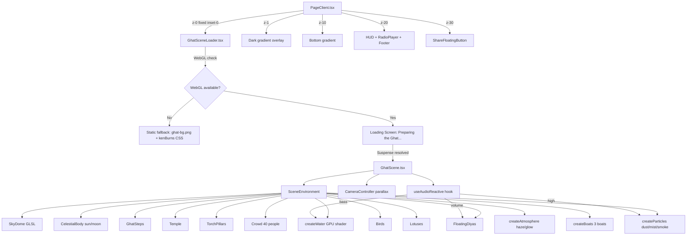

# Chhath Radio — Cinematic 3D Ghat Background: Implementation Plan

## Executive Summary

Replace the current static `ghat-bg.png` + Ken Burns CSS animation background with the fully immersive, real-time Three.js / React Three Fiber 3D Chhath Puja environment described in `prompts/design.md`. The existing `GhatScene.tsx` is already a solid foundation — this plan upgrades it to production quality with GLSL water shaders, GPU particle systems, music reactivity, a loading screen, WebGL fallback, and full responsive/accessibility support.

---

## Current State Analysis

### What exists today in `PageClient.tsx`

| Layer | z-index | What it is |
|---|---|---|
| `ghat-bg.png` | 0 | Static PNG with CSS Ken Burns animation |
| Dark gradient overlay | 1 | `rgba(8,2,2,0.45→0.55)` readability layer |
| `GeometricBg` | 5 | Canvas-based animated geometric overlay |
| Bottom gradient | 10 | Player readability gradient |
| HUD (clock, countdown, listener) | 20 | UI widgets |
| Radio player | 20 | Bottom pill |
| Footer | 20 | Footer bar |
| `ShareFloatingButton` | 30 | Fixed right-edge share button |

### What `GhatScene.tsx` already has (React Three Fiber)

- ✅ Time-of-day system (predawn / morning / afternoon / evening / night)
- ✅ Sky dome with GLSL gradient shader
- ✅ Sun/Moon with directional light + arc animation
- ✅ Animated river (CPU vertex displacement — needs upgrade to GPU shader)
- ✅ Ghat steps (box geometry)
- ✅ Temple silhouette (cone + box geometry)
- ✅ Torch pillars with flickering point lights
- ✅ Floating diyas with flicker animation
- ✅ Crowd silhouettes (40 people, animated arms)
- ✅ Birds with wing flap
- ✅ Twinkling stars (buffer geometry points)
- ✅ Lotus flowers
- ✅ Mouse/touch parallax camera controller
- ✅ `GhatSceneLoader.tsx` with `dynamic(ssr:false)` wrapper

### What `GhatScene.tsx` is missing (per `design.md`)

- ❌ GPU water shader (currently CPU vertex displacement — expensive, low quality)
- ❌ Atmospheric fog/haze shader
- ❌ Sun glow / bloom effect
- ❌ Particle systems (dust, mist, incense smoke, floating light particles)
- ❌ Music reactivity (Web Audio API analyser)
- ❌ Loading screen ("Preparing the Ghat...")
- ❌ WebGL fallback (static artwork)
- ❌ `prefers-reduced-motion` support
- ❌ Mobile performance tier (reduced DPR, particles, shadows)
- ❌ Asset manifest for GLB models
- ❌ Smooth fade-in transition after load
- ❌ `PageClient.tsx` integration (GhatSceneLoader not mounted in PageClient yet)

### Key dependency status

All required packages are **already installed**:
- `three` ^0.185.1
- `@react-three/fiber` ^9.7.0
- `@react-three/drei` ^10.7.8

No new npm packages needed.

---

## Target Architecture

```
frontend/
  components/
    ghat/
      GhatScene.tsx          ← Main scene (upgraded)
      GhatSceneLoader.tsx    ← Dynamic import wrapper (minor update)
      scene/
        createWater.tsx      ← GPU water shader component
        createParticles.tsx  ← Particle systems (dust, mist, smoke)
        createAudioReactive.tsx ← Web Audio API analyser hook
        createAtmosphere.tsx ← Fog, haze, sun glow
        createBoats.tsx      ← Animated wooden boats
        assetManifest.ts     ← GLB asset paths (easy to swap)
      shaders/
        water.vert.glsl      ← Water vertex shader
        water.frag.glsl      ← Water fragment shader
        sunGlow.frag.glsl    ← Sun glow/bloom shader
        atmosphere.frag.glsl ← Atmospheric haze shader
  public/
    chhath/
      models/                ← GLB assets (placeholder manifest)
        woman_arghya.glb
        woman_soop.glb
        man.glb
        diya.glb
        basket.glb
        sugarcane.glb
        coconut.glb
        boat.glb
        temple.glb
      textures/              ← KTX2/WebP textures
      environment/           ← HDR environment maps
    ghat-fallback.jpg        ← Static fallback for no-WebGL
```

---

## Implementation Steps

### Step 1 — Integrate `GhatSceneLoader` into `PageClient.tsx`

**File:** `frontend/components/radio/PageClient.tsx`

Replace the static `ghat-bg.png` div (Layer 0) and the `GeometricBg` (Layer 5) with `GhatSceneLoader`. The new z-index stack:

```
z-0   GhatSceneLoader (Three.js canvas, fixed inset-0)
z-1   Dark gradient overlay (keep — improves text readability over 3D)
z-10  Bottom gradient (keep)
z-20  HUD, player, footer (keep — no changes)
z-30  ShareFloatingButton (keep)
```

Remove:
- The `ghat-bg.png` background div
- The `@keyframes kenBurns` style block
- The `<GeometricBg />` import and JSX (the 3D scene replaces it)

Add:
- `import GhatSceneLoader from "@/components/ghat/GhatSceneLoader"`
- `<GhatSceneLoader audioNode={audioNode} />` at z-0

The `audioNode` prop threads the radio player's Web Audio source node into the scene for music reactivity.

---

### Step 2 — GPU Water Shader (`scene/createWater.tsx`)

Replace the current CPU vertex-displacement river with a proper GLSL shader water plane.

**Shader uniforms:**
```glsl
uniform float uTime;
uniform float uWaveStrength;    // default 0.12, bass-reactive
uniform float uReflectionStrength;
uniform vec3  uSunPosition;
uniform vec3  uWaterColor;
uniform vec3  uDeepColor;
uniform float uFoamThreshold;
```

**Vertex shader** (`water.vert.glsl`):
- Gerstner wave displacement (2 overlapping wave sets)
- Pass world position and normal to fragment

**Fragment shader** (`water.frag.glsl`):
- Fresnel-based reflection blend
- Animated UV distortion for caustic shimmer
- Sun specular highlight
- Diya reflection sprites (additive blend at diya positions)
- Depth-based color (shallow warm, deep cool)
- Subtle foam at wave crests

**Performance:** Single draw call, GPU-only, no CPU per-frame work.

---

### Step 3 — Particle Systems (`scene/createParticles.tsx`)

Four independent particle systems, all GPU-friendly:

| System | Count (desktop) | Count (mobile) | Behaviour |
|---|---|---|---|
| Morning dust | 800 | 200 | Slow upward drift, random XZ spread |
| River mist | 400 | 100 | Horizontal drift above water surface |
| Incense smoke | 200 | 60 | Upward spiral near torch pillars |
| Floating light particles | 150 | 40 | Slow float, emissive orange glow |

All use `THREE.Points` with `BufferGeometry`. Positions updated via shader (custom `ShaderMaterial` with `uTime` uniform) — zero CPU per-frame allocation.

High-frequency audio band subtly increases particle speed/opacity.

---

### Step 4 — Atmospheric Effects (`scene/createAtmosphere.tsx`)

**Sun glow:** Sprite-based additive glow disc behind the sun mesh. Uses `THREE.Sprite` with a radial gradient texture. Intensity slowly breathes (±8% over 6s cycle).

**Atmospheric haze:** Custom `FogExp2` + a full-screen quad with a depth-based haze shader that adds warm sunrise scattering. Replaces the current `THREE.Fog` setup.

**Vignette overlay:** CSS `box-shadow: inset 0 0 120px rgba(0,0,0,0.4)` on the canvas wrapper — zero GPU cost.

**Film grain:** Subtle CSS `filter: url(#grain)` SVG filter on the overlay div — imperceptible but adds cinematic texture.

---

### Step 5 — Boats (`scene/createBoats.tsx`)

Three boats:

| Boat | Detail | Position | Motion |
|---|---|---|---|
| Foreground | Medium poly, warm wood material | z = -3, x = -6 | Slow bob + 0.002 x-drift |
| Mid | Low poly, darker | z = -8, x = 4 | Slower bob |
| Background | Silhouette only | z = -14, x = -2 | Nearly static |

Each boat has a tiny wake: two `PlaneGeometry` quads with animated opacity behind it.

---

### Step 6 — Music Reactivity (`scene/createAudioReactive.tsx`)

Custom React hook `useAudioReactive(audioNode: AudioNode | null)`:

```typescript
interface AudioBands {
  bass: number;    // 0–1, 20–250 Hz
  mid: number;     // 0–1, 250–2000 Hz
  high: number;    // 0–1, 2000–8000 Hz
  volume: number;  // 0–1, overall RMS
}
```

Implementation:
1. Create `AnalyserNode` from the passed `AudioNode`
2. `requestAnimationFrame` loop reads `getByteFrequencyData`
3. Averages frequency bins into the four bands
4. Returns a `ref` (not state — no re-renders) with current band values

Usage in scene:
- `bass` → `uWaveStrength` uniform on water shader (subtle ripple increase)
- `volume` → diya `emissiveIntensity` multiplier (±15%)
- `high` → particle speed multiplier (±20%)

If `audioNode` is null, all values default to 0.5 (neutral, scene still animates beautifully).

---

### Step 7 — Loading Experience

**File:** `GhatSceneLoader.tsx` (updated)

Loading sequence:
1. Show loading screen immediately: dark `#0d0505` background + centered text
2. Text: `"🪔 Preparing the Ghat..."` in orange, Devanagari subtitle `"छठ का माहौल बन रहा है..."`
3. Subtle pulsing animation on the diya emoji
4. Three.js `<Suspense>` resolves → scene is ready
5. Fade out loading screen over 800ms with CSS transition
6. Scene fades in simultaneously

```tsx
// GhatSceneLoader.tsx loading state
<div className="fixed inset-0 z-0 bg-[#0d0505] flex flex-col items-center justify-center"
     style={{ opacity: isLoaded ? 0 : 1, transition: 'opacity 0.8s ease' }}>
  <span className="text-4xl animate-pulse">🪔</span>
  <p className="text-orange-400 text-lg mt-3 font-semibold">Preparing the Ghat...</p>
  <p className="text-orange-600 text-sm mt-1" style={{fontFamily: 'Noto Sans Devanagari'}}>
    छठ का माहौल बन रहा है...
  </p>
</div>
```

---

### Step 8 — WebGL Fallback

**File:** `GhatSceneLoader.tsx` (updated)

WebGL detection:
```typescript
function isWebGLAvailable(): boolean {
  try {
    const canvas = document.createElement('canvas');
    return !!(canvas.getContext('webgl2') || canvas.getContext('webgl'));
  } catch { return false; }
}
```

If WebGL unavailable → render a static fallback:
```tsx
<div className="fixed inset-0 z-0"
     style={{
       backgroundImage: "url('/ghat-fallback.jpg')",
       backgroundSize: 'cover',
       backgroundPosition: 'center',
       animation: 'kenBurns 30s ease-in-out infinite alternate'
     }} />
```

The `ghat-bg.png` already in `public/` serves as the fallback image (rename/copy to `ghat-fallback.jpg` or reuse the same path).

---

### Step 9 — `prefers-reduced-motion` Support

In `GhatScene.tsx`, read the media query:
```typescript
const prefersReduced = window.matchMedia('(prefers-reduced-motion: reduce)').matches;
```

When `true`:
- Camera controller: disable all movement (lock to initial position)
- Particles: set opacity to 0, skip frame updates
- Diya flicker: set to constant intensity (no sine wave)
- Water: freeze `uTime` uniform
- Birds: stop movement
- Scene still renders beautifully as a static cinematic frame

---

### Step 10 — Mobile Performance Tier

Detect mobile via `window.innerWidth < 768` or `navigator.maxTouchPoints > 0`:

| Setting | Desktop | Mobile |
|---|---|---|
| `dpr` | `[1, 1.5]` | `[1, 1]` |
| Shadow map size | 2048×2048 | 512×512 |
| Particle count | 100% | 25% |
| Diya count | per TOD config | 50% |
| Bird count | per TOD config | 50% |
| Water geometry segments | 64×32 | 32×16 |
| Crowd count | 40 | 20 |
| Lotus count | 12 | 6 |
| Antialias | true | false |

---

### Step 11 — Asset Manifest (`scene/assetManifest.ts`)

```typescript
export const CHHATH_ASSETS = {
  characters: {
    womanArghya:  '/chhath/models/woman_arghya.glb',
    womanSoop:    '/chhath/models/woman_soop.glb',
    man:          '/chhath/models/man.glb',
  },
  props: {
    diya:         '/chhath/models/diya.glb',
    basket:       '/chhath/models/basket.glb',
    sugarcane:    '/chhath/models/sugarcane.glb',
    coconut:      '/chhath/models/coconut.glb',
    banana:       '/chhath/models/banana.glb',
    thekua:       '/chhath/models/thekua.glb',
    marigold:     '/chhath/models/marigold.glb',
    kalash:       '/chhath/models/kalash.glb',
  },
  environment: {
    temple:       '/chhath/models/temple.glb',
    boat:         '/chhath/models/boat.glb',
    ghats:        '/chhath/models/ghats.glb',
    bananaPlant:  '/chhath/models/banana_plant.glb',
  },
  textures: {
    waterNormal:  '/chhath/textures/water_normal.webp',
    stoneDiffuse: '/chhath/textures/stone_diffuse.webp',
    woodDiffuse:  '/chhath/textures/wood_diffuse.webp',
  },
} as const;
```

The scene uses procedural geometry now. When GLB assets are available, swap the procedural components one-by-one using `useGLTF` from `@react-three/drei` — no architecture change needed.

---

## File Change Summary

| File | Action | Description |
|---|---|---|
| `components/radio/PageClient.tsx` | Modify | Remove ghat-bg.png div + GeometricBg, add GhatSceneLoader |
| `components/ghat/GhatScene.tsx` | Modify | Add prefers-reduced-motion, mobile tier, audio reactive props |
| `components/ghat/GhatSceneLoader.tsx` | Modify | Add loading screen, WebGL fallback, fade-in transition |
| `components/ghat/scene/createWater.tsx` | Create | GPU water shader component |
| `components/ghat/scene/createParticles.tsx` | Create | Particle systems |
| `components/ghat/scene/createAudioReactive.tsx` | Create | Web Audio API hook |
| `components/ghat/scene/createAtmosphere.tsx` | Create | Sun glow, haze, vignette |
| `components/ghat/scene/createBoats.tsx` | Create | Animated boats |
| `components/ghat/scene/assetManifest.ts` | Create | GLB asset path registry |
| `components/ghat/shaders/water.vert.glsl` | Create | Water vertex shader |
| `components/ghat/shaders/water.frag.glsl` | Create | Water fragment shader |
| `components/ghat/shaders/sunGlow.frag.glsl` | Create | Sun glow shader |
| `public/chhath/models/.gitkeep` | Create | Asset directory placeholder |
| `public/chhath/textures/.gitkeep` | Create | Texture directory placeholder |

**No new npm packages required.** All dependencies (`three`, `@react-three/fiber`, `@react-three/drei`) are already installed.

---

## Z-Index Architecture (Final)

```
z-0   GhatSceneLoader → Three.js Canvas (fixed inset-0, pointer-events-none)
z-1   Dark gradient overlay (rgba 0.45→0.55, pointer-events-none)
z-10  Bottom gradient for player readability (pointer-events-none)
z-20  HUD: ListenerCount (top-left), ChhathCountdown (top-center), LiveClock (top-right)
z-20  ChhathFacts ticker (above player)
z-20  RadioPlayer pill (bottom)
z-20  Footer bar (bottom-0)
z-30  ShareFloatingButton (fixed right-center)
z-100 TuneInSplash (until user clicks)
```

---

## Animation Loop Architecture

Single `useFrame` in `GhatScene.tsx` orchestrates all sub-systems via refs:

```
useFrame(delta) {
  1. clock.current += delta
  2. cameraController.update(mouse, clock, prefersReduced)
  3. water.updateUniforms(clock, audioBands)
  4. particles.update(clock, audioBands, prefersReduced)
  5. diyas.update(clock, audioBands)
  6. boats.update(clock)
  7. birds.update(clock, prefersReduced)
  8. celestialBody.update(clock)
  9. atmosphere.update(clock)
}
```

No multiple `requestAnimationFrame` loops. Delta-time based — frame-rate independent.

---

## Mermaid Architecture Diagram



---

## Performance Targets

| Metric | Desktop | Mobile |
|---|---|---|
| Target FPS | 60 | 30–60 |
| Draw calls | < 40 | < 20 |
| Triangles | < 150k | < 60k |
| Texture memory | < 64 MB | < 32 MB |
| JS heap (scene) | < 50 MB | < 25 MB |

---

## Remaining Limitations (honest assessment)

1. **No real GLB character models yet.** The crowd uses procedural cylinder/sphere geometry. The asset manifest is ready — swap in GLBs when available.
2. **No depth of field.** R3F post-processing (`@react-three/postprocessing`) would add ~15% GPU cost. Deferred to a future pass.
3. **No HDR environment map.** Using `ambientLight` + `directionalLight` instead. An HDR `.exr` would improve PBR material quality significantly.
4. **Water reflections are shader-approximated**, not true planar reflections (which require a second render pass and double draw calls).
5. **Incense smoke** uses billboard sprites, not volumetric simulation.

---

## Commands to Run After Implementation

```bash
cd frontend
npm run dev          # Start dev server — verify scene loads
npm run build        # Verify no TypeScript/build errors
npm run test         # Run existing unit tests — must still pass
```

---

*Plan authored by Lyzo — Project Planner mode. Switch to Code mode to implement.*