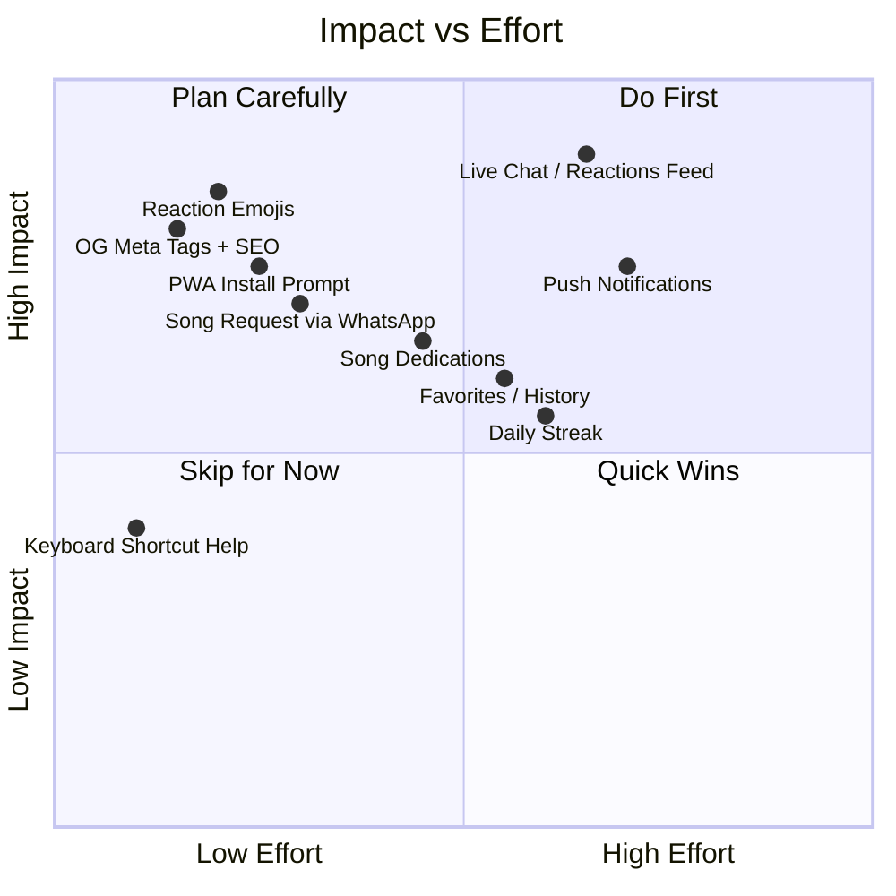
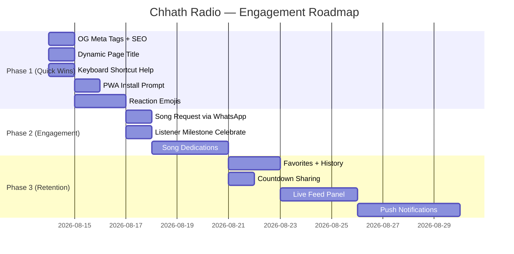

# Chhath Radio — User Interaction, Traffic & Retention Plan

## What You Currently Have (Audit)

From the live app inspection and code review, here is every interactive element that exists today:

| Feature | Component | Status |
|---|---|---|
| Tune In splash screen | `TuneInSplash.tsx` | ✅ Working |
| Play / Pause / Prev / Next | `RadioPlayer.tsx` | ✅ Working |
| Volume slider + mute toggle | `RadioPlayer.tsx` | ✅ Working |
| Seek bar with timestamps | `RadioPlayer.tsx` | ✅ Working |
| Playlist drawer (click to jump) | `RadioPlayer.tsx` | ✅ Working |
| Keyboard shortcuts (Space, Arrow, M, P) | `RadioPlayer.tsx` | ✅ Working |
| Live listener count | `ListenerCount.tsx` | ✅ Working |
| Chhath countdown (4-day cycle, clickable) | `ChhathCountdown.tsx` | ✅ Working |
| Live clock (IST) | `LiveClock.tsx` | ✅ Working |
| Chhath facts typewriter ticker | `ChhathFacts.tsx` | ✅ Working |
| Share floating button | `ShareFloatingButton.tsx` | ✅ Working |
| Share modal (card preview, download, WhatsApp, Telegram, Twitter, copy link) | `ShareModal.tsx` | ✅ Working |
| Donate button (UPI modal) | `PageClient.tsx` / `Footer.tsx` | ✅ Working |
| Instagram + LinkedIn links | `PageClient.tsx` | ✅ Working |
| 3D Ghat scene background | `GhatSceneLoader.tsx` | ✅ Working |

---

## Gap Analysis — What's Missing

Despite the beautiful UI, the app is essentially **read-only** for users. There is no:
- Way for users to express themselves or react
- Community / social layer (no comments, no reactions, no chat)
- Reason to come back daily (no streaks, no notifications, no "what's new")
- SEO or discoverability (single-page app with no meta tags, no OG image, no sitemap)
- Mobile PWA install prompt
- Song request mechanism
- Personalization (no favorites, no history)
- Analytics to understand what users do

---

## Proposed Features — Prioritized by Impact vs. Effort



---

## Phase 1 — Quick Wins (1–3 days, highest ROI)

### 1.1 Floating Reaction Emojis ("Jal Arghya" reactions)

**What:** A row of 5 Chhath-themed emoji buttons (🪔 🙏 🌅 🌊 ☀️) that users can tap. Each tap sends a floating emoji animation up the screen (like TikTok live reactions). The count is stored in the backend and shown to all listeners in real-time via SSE.

**Why it drives retention:** It gives users a way to *participate* without creating an account. It creates a shared emotional moment. It's highly shareable ("2,847 🪔 reactions today!").

**Implementation:**
- New `ReactionBar.tsx` component — 5 emoji buttons, bottom-left of screen
- Backend: `POST /api/reactions` increments a Redis counter per emoji per day
- Backend: SSE stream pushes reaction counts to all connected clients
- Frontend: On tap, spawn a `FloatingEmoji` div that animates upward and fades out (CSS keyframes)
- Show total reaction count for the day in the listener count widget

**Files to create/modify:**
- `frontend/components/radio/ReactionBar.tsx` (new)
- `frontend/components/radio/PageClient.tsx` (add ReactionBar)
- `backend/app/api/reactions.py` (new endpoint)
- `backend/app/main.py` (register router)

---

### 1.2 Open Graph Meta Tags + SEO

**What:** Add proper `<head>` meta tags so that when someone shares the link on WhatsApp, Twitter, or iMessage, it shows a rich preview card with the Chhath Radio logo, tagline, and a beautiful OG image.

**Why it drives traffic:** Every share currently shows a blank link. A rich preview card gets 3–5× more clicks. This is the single highest-leverage traffic driver.

**Implementation:**
- In `frontend/app/layout.tsx` (or `page.tsx`), add Next.js `metadata` export:
  ```ts
  export const metadata: Metadata = {
    title: "Chhath Radio — छठ के गीत, बिना रुके",
    description: "Listen to Chhath Puja geet live, 24/7. Dedicated to Chhathi Maiya.",
    openGraph: {
      title: "Chhath Radio 🪔",
      description: "छठ के गीत, बिना रुके — Listen live",
      url: "https://chhathradio.com",
      siteName: "Chhath Radio",
      images: [{ url: "/og-image.png", width: 1200, height: 630 }],
      locale: "hi_IN",
      type: "website",
    },
    twitter: { card: "summary_large_image", ... },
  };
  ```
- Create a static `/public/og-image.png` (1200×630) — a beautiful Chhath scene with the logo
- Add `<link rel="canonical">` and `robots.txt`

**Files to modify:**
- `frontend/app/layout.tsx`
- `frontend/app/page.tsx`
- `frontend/public/og-image.png` (new asset)
- `frontend/public/robots.txt` (new)

---

### 1.3 PWA Install Prompt ("Add to Home Screen")

**What:** When a mobile user visits the site, show a subtle bottom banner after 30 seconds: *"Add Chhath Radio to your home screen for instant access 🪔"* with an Install button. On iOS, show manual instructions.

**Why it drives retention:** PWA users return 3× more often than browser users. The app icon on their home screen is a daily reminder. It also enables push notifications later.

**Implementation:**
- Add `frontend/public/manifest.json` with app name, icons, theme color `#f97316`
- Add `<link rel="manifest">` in `layout.tsx`
- Create `frontend/components/radio/PwaInstallBanner.tsx`:
  - Listen for `beforeinstallprompt` event
  - Show banner after 30s if not already installed
  - On iOS (no `beforeinstallprompt`), show "Tap Share → Add to Home Screen" instructions
- Store `pwa_dismissed` in localStorage to not re-show

**Files to create/modify:**
- `frontend/public/manifest.json` (new)
- `frontend/public/icons/` (new — 192×192, 512×512 PNG icons)
- `frontend/components/radio/PwaInstallBanner.tsx` (new)
- `frontend/app/layout.tsx` (add manifest link)
- `frontend/components/radio/PageClient.tsx` (add PwaInstallBanner)

---

### 1.4 Keyboard Shortcut Help Tooltip

**What:** A small `?` button (bottom-right, above footer) that shows a popover listing all keyboard shortcuts. Currently the shortcuts exist but are completely undiscoverable.

**Shortcuts to document:**
- `Space` — Play / Pause
- `→` — Seek +10s
- `←` — Seek −10s
- `Shift+→` — Next song
- `Shift+←` — Previous song
- `M` — Mute / Unmute
- `P` — Toggle playlist

**Files to create/modify:**
- `frontend/components/radio/KeyboardHelpButton.tsx` (new)
- `frontend/components/radio/PageClient.tsx` (add button)

---

## Phase 2 — Engagement Features (1–2 weeks)

### 2.1 Song Dedication / Shoutout

**What:** A button in the player ("Dedicate this song 🪔") that opens a small form: *"Dedicated to: [name]"* + optional message (max 80 chars). Submissions appear in a scrolling ticker above the player, replacing or alternating with the Chhath facts ticker.

**Why it drives traffic:** Dedications are highly shareable. "My dedication is playing on Chhath Radio!" creates organic word-of-mouth. Users will share the link to show their friends.

**Implementation:**
- New `DedicationForm.tsx` modal — name + message fields, submit button
- Backend: `POST /api/dedications` stores in DB with timestamp, song_id, moderation status
- Backend: `GET /api/dedications/live` returns last 10 approved dedications
- Frontend: `DedicationTicker.tsx` alternates with `ChhathFacts.tsx` (every other rotation)
- Admin: Simple moderation flag in the existing admin panel

**Files to create/modify:**
- `frontend/components/radio/DedicationForm.tsx` (new)
- `frontend/components/radio/DedicationTicker.tsx` (new)
- `frontend/components/radio/PageClient.tsx` (integrate)
- `backend/app/api/dedications.py` (new)
- `backend/alembic/versions/` (new migration for dedications table)

---

### 2.2 Song Request via WhatsApp

**What:** A "Request a Song 🎵" button that opens WhatsApp with a pre-filled message: *"🪔 Song request for Chhath Radio: [song name]. Listen at chhathradio.com"* sent to the admin's WhatsApp number.

**Why it drives traffic:** Zero backend work. Users feel heard. The WhatsApp message includes the site URL, creating organic sharing.

**Implementation:**
- Add a "Request" button to the `RadioPlayer.tsx` controls row (small icon, after playlist)
- On click, open `https://wa.me/91XXXXXXXXXX?text=...` with pre-filled text
- Show a tooltip: "Request a Chhath geet via WhatsApp"

**Files to modify:**
- `frontend/components/radio/RadioPlayer.tsx`
- `frontend/components/radio/PageClient.tsx` (pass admin WhatsApp number from env)

---

### 2.3 "Now Playing" Dynamic Page Title

**What:** Update the browser tab title to show the currently playing song: *"🪔 Kelwa Ke Paat Par — Chhath Radio"*. When paused, revert to the default title.

**Why it drives retention:** Users with many tabs open can see what's playing without switching. It's a tiny change with outsized UX impact.

**Implementation:**
- In `RadioPlayer.tsx`, add a `useEffect` that calls `document.title = ...` whenever `currentSong` changes
- When paused/idle: `document.title = "Chhath Radio — छठ के गीत, बिना रुके"`

**Files to modify:**
- `frontend/components/radio/RadioPlayer.tsx` (add 5-line useEffect)

---

### 2.4 Listener Milestone Celebrations

**What:** When the live listener count hits a round number (10, 25, 50, 100, 500…), show a brief full-screen celebration: floating 🪔 emojis + a toast message *"100 people listening together! 🙏"*

**Why it drives retention:** Creates a shared moment. Users feel part of a community. They're more likely to stay and share.

**Implementation:**
- In `ListenerCount.tsx`, track previous count and detect milestone crossings
- Trigger a `MilestoneCelebration.tsx` overlay (3-second animation, then auto-dismiss)
- Store `last_celebrated_milestone` in sessionStorage to avoid re-triggering on refresh

**Files to create/modify:**
- `frontend/components/radio/MilestoneCelebration.tsx` (new)
- `frontend/components/radio/ListenerCount.tsx` (detect milestones)
- `frontend/components/radio/PageClient.tsx` (render celebration overlay)

---

## Phase 3 — Retention & Growth (2–4 weeks)

### 3.1 Push Notifications (Web Push)

**What:** After a user has been on the site for 2 minutes, show a permission prompt: *"Get notified when Chhath Radio goes live for Arghya 🪔"*. Send push notifications on Chhath festival days (Sandhya Arghya, Usha Arghya).

**Why it drives traffic:** Push notifications bring users back on the most important days — the actual festival. This is the highest-value retention tool for a seasonal app.

**Implementation:**
- Add a Service Worker (`frontend/public/sw.js`) for push subscription
- Backend: `POST /api/push/subscribe` stores push subscription in DB
- Backend: Admin can trigger a push broadcast via `POST /api/push/broadcast`
- Frontend: `PushPermissionPrompt.tsx` — shown after 2 min, dismissible

**Files to create/modify:**
- `frontend/public/sw.js` (new)
- `frontend/components/radio/PushPermissionPrompt.tsx` (new)
- `backend/app/api/push.py` (new)
- `backend/requirements.txt` (add `pywebpush`)

---

### 3.2 "Listening Together" Live Chat / Reaction Feed

**What:** A collapsible side panel (right edge, above the share button) showing a live feed of reactions and dedications from all current listeners. Each entry shows: emoji + anonymous name (auto-generated Chhath names like "Devotee from Patna") + message.

**Why it drives retention:** Social presence dramatically increases session length. Knowing others are listening creates FOMO and community.

**Implementation:**
- Backend: SSE stream at `/api/events/feed` pushes reactions + dedications in real-time
- Frontend: `LiveFeedPanel.tsx` — collapsible, shows last 20 events, auto-scrolls
- Anonymous names: Pick from a list of Chhath-themed names + city names

**Files to create/modify:**
- `frontend/components/radio/LiveFeedPanel.tsx` (new)
- `backend/app/api/events.py` (extend existing SSE)
- `frontend/components/radio/PageClient.tsx` (add panel)

---

### 3.3 Favorites & Listening History (LocalStorage)

**What:** A ❤️ button on each song in the playlist drawer. Favorited songs are saved to localStorage. A "My Favorites" tab in the playlist drawer shows them. Listening history (last 20 songs) is also tracked.

**Why it drives retention:** Personalization creates ownership. Users return to hear their saved songs.

**Implementation:**
- Add `favorites: string[]` and `history: Song[]` to a new `useUserStore` (Zustand + localStorage persist)
- Add ❤️ toggle button to each row in `PlaylistDrawer`
- Add "Favorites" tab to the playlist drawer header
- No backend needed — pure localStorage

**Files to create/modify:**
- `frontend/lib/user-store.ts` (new Zustand store with `persist` middleware)
- `frontend/components/radio/RadioPlayer.tsx` (add favorite button to playlist rows)

---

### 3.4 Chhath Countdown Sharing

**What:** A "Share Countdown" button inside the `ChhathCountdown` widget. Clicking it generates a shareable image (using the existing `html-to-image` library) showing the countdown to the next Chhath ritual, and opens the share modal.

**Why it drives traffic:** Countdown images are highly viral on WhatsApp groups in the Bihar/UP diaspora community. Each share brings new visitors.

**Implementation:**
- Add a small share icon button to `ChhathCountdown.tsx`
- On click, capture the countdown widget as PNG using `toPng()`
- Open a simplified share modal with WhatsApp + Download options

**Files to modify:**
- `frontend/components/radio/ChhathCountdown.tsx`
- Reuse `ShareModal.tsx` logic

---

## Summary: Implementation Order



---

## Traffic Growth Strategies (Non-Code)

These require no code changes but will drive significant traffic:

1. **WhatsApp Group Blasting** — Share the OG-image link in Bihar/UP/Jharkhand diaspora WhatsApp groups before Chhath season (October). The countdown widget makes this timely and relevant.

2. **Instagram Reels** — Record a 15-second screen recording of the 3D ghat scene + music playing. Post with hashtags: `#ChhathPuja #ChhathGeet #ChhathRadio #BiharFestival`. The visual is stunning and will stop scrollers.

3. **YouTube Community Post** — Post the share card image on YouTube with a link. Chhath geet channels have millions of subscribers.

4. **Google Search Console** — Submit the sitemap after adding SEO meta tags. The site will start ranking for "Chhath geet online", "Chhath radio", "Chhath Puja songs live".

5. **Seasonal Timing** — The app's peak traffic window is 2–3 weeks before Chhath (mid-October). All Phase 1 features should be live by October 1st.

---

## Metrics to Track

Once Google Analytics or Plausible is added:

| Metric | Target | How to Measure |
|---|---|---|
| Daily Active Users | 500+ during festival | Analytics |
| Session Duration | >5 minutes | Analytics |
| Return Rate (7-day) | >30% | Analytics |
| Share Card Downloads | 100+/day | Backend counter |
| PWA Installs | 200+ | `appinstalled` event |
| Reaction Count | 1000+/day | Backend counter |
| WhatsApp Shares | Track via UTM params | Analytics |