# Chhath Radio — Test Suite Rewrite & Runner Plan

## Overview

The existing tests are **stale and broken** — they reference APIs that no longer exist in the current codebase (e.g. `PRESENCE_KEY_PREFIX`, `get_redis_client`, `scan`-based patterns in `presence_service`). This plan covers a complete rewrite of all test suites to match the current app, plus a unified test runner script and Makefile updates.

---

## What's Broken Today

| File | Problem |
|---|---|
| `backend/tests/unit/test_presence_service.py` | Imports `PRESENCE_KEY_PREFIX` and `get_redis_client` — neither exists. Uses `scan`-based mock; current service uses `zadd`/`zcount` on a sorted set. |
| `backend/tests/unit/test_song_service.py` | `TestGetRadioQueue` doesn't account for Redis cache layer (`_cache_get`/`_cache_set`). |
| `backend/tests/unit/test_schemas_song.py` | Needs verification against current `SongCreate`/`SongUpdate` schemas. |
| `backend/tests/unit/test_security.py` | Needs verification against current `auth/security.py`. |
| `backend/tests/integration/api/test_songs_queue.py` | References `/api/songs` — need to confirm this route still exists (it's in `songs.py`). |
| `frontend/__tests__/` | No tests for `radio-store`, `api.ts`, or `user-store`. Playwright E2E tests need updating for current UI. |
| `qa-tests/app/backend/unit/test_presence_service.py` | Same stale imports as above. |

---

## Architecture of the New Test Suite

```mermaid
graph TD
    A[make test SUITE=backend] --> B[Backend Unit Tests]
    A2[make test SUITE=frontend] --> C[Frontend Unit Tests]
    A2 --> D[Frontend E2E - Playwright]
    A3[make test] --> B
    A3 --> C
    A3 --> D

    B --> B1[test_presence_service.py - zadd/zcount mocks]
    B --> B2[test_song_service.py - cache-aware]
    B --> B3[test_chat_api.py - NEW]
    B --> B4[test_admin_auth.py - integration]
    B --> B5[test_songs_queue.py - integration]
    B --> B6[test_health.py - NEW]

    C --> C1[radio-store.test.ts - rewritten]
    C --> C2[youtube-adapter.test.ts - existing, verify]
    C --> C3[api.test.ts - NEW]
    C --> C4[time-of-day.test.ts - existing, verify]

    D --> D1[radio-page.spec.ts - player loads]
    D --> D2[chat.spec.ts - NEW send/receive]
    D --> D3[presence.spec.ts - NEW listener count]
    D --> D4[admin.spec.ts - NEW login flow]
```



---

## 1. Backend Tests (Python / pytest)

### 1.1 Rewritten: `test_presence_service.py`

**Location:** `backend/tests/unit/test_presence_service.py`

The current `presence_service.py` uses:
- `COUNTER_KEY = "chhath:listeners:count"` (integer counter)
- `SESSIONS_KEY = "chhath:listeners:sessions"` (sorted set, score = expiry timestamp)
- `zadd(SESSIONS_KEY, {session_id: expiry}, nx=True)` — returns 1 for new, 0 for existing
- `zcount(SESSIONS_KEY, now, "+inf")` — for `get_listener_count()`
- `zrem(SESSIONS_KEY, session_id)` — for `remove_session()`
- `zremrangebyscore(SESSIONS_KEY, "-inf", now)` — for `_prune_expired()`
- In-memory fallback via `_mem_sessions` dict

**Test cases to write:**

```
TestRecordHeartbeat
  - new session: zadd returns 1 → incr is called
  - existing session: zadd returns 0 → incr NOT called, zadd called again to refresh score
  - redis error: falls back to _mem_heartbeat (session added to _mem_sessions)
  - redis unavailable (client=None): uses _mem_heartbeat

TestGetListenerCount
  - redis available: calls zcount(SESSIONS_KEY, now, "+inf") and returns result
  - redis unavailable: falls back to _mem_count (filters expired sessions)
  - redis error: falls back to _mem_count

TestRemoveSession
  - session exists: zrem returns 1 → decr called
  - counter goes negative: set(COUNTER_KEY, 0) called
  - session not found: zrem returns 0 → decr NOT called
  - redis unavailable: pops from _mem_sessions

TestPruneExpired
  - removes expired sessions and decrements counter by count removed
  - counter goes negative: clamped to 0

TestMemoryFallback
  - _mem_count prunes expired sessions automatically
  - _mem_heartbeat sets correct expiry (time.time() + SESSION_TTL_SECONDS)
```

### 1.2 Rewritten: `test_song_service.py`

**Location:** `backend/tests/unit/test_song_service.py`

The current `song_service.py` has a Redis cache layer (`_cache_get`/`_cache_set`/`_cache_delete`). The existing test for `get_radio_queue` doesn't mock the cache.

**New/updated test cases:**

```
TestGetRadioQueue (updated)
  - cache miss: _cache_get returns None → DB queried → _cache_set called
  - cache hit: _cache_get returns list → DB NOT queried → cached dicts returned
  - cache unavailable (redis None): falls through to DB transparently

TestCreate (existing tests are good, add:)
  - cache is invalidated after create (_cache_delete called with QUEUE_CACHE_KEY)

TestUpdate (existing tests are good, add:)
  - cache is invalidated after update

TestDelete (existing tests are good, add:)
  - cache is invalidated after delete
```

### 1.3 New: `test_chat_api.py`

**Location:** `backend/tests/unit/test_chat_api.py`

Tests for `app/api/chat.py`:

```
TestStoreMessage
  - stores to Redis sorted set with correct score (unix timestamp)
  - prunes messages older than MESSAGE_TTL_SECONDS
  - enforces MAX_MESSAGES cap via zremrangebyrank
  - falls back to _memory_messages when Redis unavailable

TestLoadMessages
  - loads from Redis zrangebyscore with cutoff = now - TTL
  - returns oldest-first, limited to `limit` param
  - falls back to _memory_messages when Redis unavailable

TestRateLimit
  - first message from IP: allowed
  - second message within 3s: 429 returned
  - message after 3s: allowed
  - rate limit dict cleanup when > 10,000 entries

TestSendMessageEndpoint (integration via TestClient)
  - POST /api/chat/messages with valid body → 201, returns ChatMessageOut
  - empty name → random bhakti name assigned
  - provided name → used as-is
  - text too long (>200 chars) → 422
  - rate limited → 429

TestGetMessagesEndpoint (integration via TestClient)
  - GET /api/chat/messages → 200, list of ChatMessageOut
  - limit param respected (max capped at MAX_MESSAGES)

TestBroadcast
  - broadcast_message pushes to all registered queues
  - full queue is removed from registry (dead queue cleanup)
```

### 1.4 New: `test_health.py`

**Location:** `backend/tests/integration/api/test_health.py`

```
- GET /api/health → 200, {"status": "ok", "service": "chhath-radio-api"}
```

### 1.5 New: `test_presence_api.py`

**Location:** `backend/tests/integration/api/test_presence_api.py`

```
TestHeartbeatEndpoint
  - POST /api/presence/heartbeat with valid session_id → 204
  - missing session_id → 422

TestListenersEndpoint
  - GET /api/presence/listeners → 200, {"count": <int>}
  - count is non-negative integer
```

### 1.6 Existing (verify & keep): `test_admin_auth.py`, `test_songs_queue.py`

These integration tests are well-written and match the current API. Keep them as-is but move them into the canonical `backend/tests/` tree (they currently also exist in `qa-tests/app/backend/`).

---

## 2. Frontend Tests (TypeScript / Vitest)

### 2.1 Rewritten: `radio-store.test.ts`

**Location:** `frontend/__tests__/unit/radio-store.test.ts`

Uses `MockYouTubePlayerAdapter` from `youtube-adapter.ts`.

```
TestLoadQueue
  - sets queue, currentIndex=0, playState=IDLE
  - generates new radioSessionId on each load
  - subscribes to adapter state changes

TestCurrentSong
  - returns queue[currentIndex]
  - returns null when queue is empty

TestUpNextSongs
  - returns next N songs after currentIndex
  - returns empty array at end of queue

TestStartPlayback
  - when adapter state is PAUSED: calls adapter.play(), does NOT reload video
  - when adapter state is CUED: calls adapter.play()
  - otherwise: calls adapter.loadVideo(currentSong.youtube_video_id), sets BUFFERING
  - no-op when queue is empty

TestPausePlayback
  - calls adapter.pause(), sets playState=PAUSED

TestNextSong
  - advances currentIndex, calls adapter.loadVideo(nextSong.youtube_video_id)
  - at end of queue: wraps to index 0, sets playState=IDLE

TestHandleAdapterStateChange
  - PLAYING → playState=PLAYING
  - PAUSED → playState=PAUSED
  - BUFFERING → playState=BUFFERING
  - ENDED → auto-advances to next song (calls loadVideo)
  - ENDED at last song → wraps to index 0, playState=IDLE
  - ERROR → skips broken song, loads next
  - ERROR at last song → playState=ERROR
  - stale session ID → event ignored (session guard)
```

### 2.2 New: `api.test.ts`

**Location:** `frontend/__tests__/unit/api.test.ts`

Uses `vi.stubGlobal('fetch', ...)` to mock fetch.

```
TestFetchRadioQueue
  - successful fetch → returns Song[]
  - non-ok response → throws Error

TestFetchListenerCount
  - successful fetch → returns count number
  - non-ok response → returns 0

TestSendHeartbeat
  - calls POST /api/presence/heartbeat with correct body

TestFetchChatHistory
  - successful fetch → returns ChatMessage[]
  - non-ok response → returns []
  - network error → returns []

TestPostChatMessage
  - successful POST → returns ChatMessage
  - non-ok response → throws Error with detail from response

TestAdminLogin
  - successful POST → returns {access_token, token_type}
  - non-ok response → throws "Invalid credentials"
```

### 2.3 Existing (verify & keep): `youtube-adapter.test.ts`, `time-of-day.test.ts`, `time-of-day-lerp.test.ts`

These test pure logic and should still pass. Verify they run cleanly.

---

## 3. Frontend E2E Tests (Playwright)

**Location:** `frontend/__tests__/e2e/`

Playwright is already configured in [`playwright.config.ts`](frontend/playwright.config.ts) pointing at `http://localhost:3000`. The existing `radio.spec.ts` needs updating and new specs need to be added.

### 3.1 Rewritten: `radio.spec.ts`

```
- page loads without JS errors
- page title contains "Chhath Radio" or equivalent
- play button is visible
- clicking play button changes UI state (buffering/playing indicator)
- song title is displayed after playback starts
- listener count element is visible on page
```

### 3.2 New: `chat.spec.ts`

```
- chat FAB button is visible
- clicking FAB opens the chat drawer
- chat drawer has a text input and send button
- typing a message and clicking send shows the message in the chat list
- sending a second message within 3 seconds shows rate limit feedback
- closing the drawer hides it
```

### 3.3 New: `presence.spec.ts`

```
- listener count is displayed (number >= 1 after page load)
- listener count updates after heartbeat interval (mock or wait)
```

### 3.4 New: `admin.spec.ts`

```
- GET /admin redirects to login if not authenticated
- login form accepts email + password
- valid credentials → redirected to admin dashboard
- invalid credentials → error message shown
- admin dashboard lists songs
- admin can toggle a song's enabled state
```

---

## 4. Unified Test Runner Script

**Location:** `scripts/test.sh` (new file, replaces the role of `qa-tests/run.sh` for the canonical test suites)

The script accepts an optional `SUITE` parameter:

```bash
# Run all tests (default when no param)
bash scripts/test.sh

# Run only backend tests
bash scripts/test.sh backend

# Run only frontend tests (unit + E2E)
bash scripts/test.sh frontend

# Run only frontend unit tests
bash scripts/test.sh frontend-unit

# Run only E2E tests
bash scripts/test.sh e2e
```

**Script logic:**

```
parse $1 (optional):
  ""            → run_backend && run_frontend_unit && run_e2e
  "backend"     → run_backend
  "frontend"    → run_frontend_unit && run_e2e
  "frontend-unit" → run_frontend_unit
  "e2e"         → run_e2e
  *             → print usage, exit 1

run_backend():
  cd backend
  python -m pytest tests/ -v --tb=short --color=yes
  return exit code

run_frontend_unit():
  cd frontend
  npx vitest run --reporter=verbose
  return exit code

run_e2e():
  cd frontend
  npx playwright test --reporter=list
  return exit code

print summary of pass/fail per suite
exit 1 if any suite failed
```

---

## 5. Makefile Updates

The Makefile already has `test-backend`, `test-frontend`, `test-e2e` targets but they all delegate to `qa-tests/run.sh`. We'll add a new canonical `test` target that uses `scripts/test.sh` with the `SUITE` parameter:

```makefile
# New canonical test target
# Usage:
#   make test              → runs all suites (backend + frontend unit + E2E)
#   make test SUITE=backend
#   make test SUITE=frontend
#   make test SUITE=frontend-unit
#   make test SUITE=e2e
test:
	@bash scripts/test.sh $(SUITE)
```

The existing `test-backend`, `test-frontend-unit`, `test-e2e` targets become thin wrappers:

```makefile
test-backend:
	@bash scripts/test.sh backend

test-frontend-unit:
	@bash scripts/test.sh frontend-unit

test-e2e:
	@bash scripts/test.sh e2e
```

---

## 6. File Change Summary

### New files to create

| File | Purpose |
|---|---|
| `backend/tests/unit/test_chat_api.py` | Unit + integration tests for chat API |
| `backend/tests/unit/test_presence_api.py` | Integration tests for presence endpoints |
| `backend/tests/integration/api/test_health.py` | Health endpoint test |
| `frontend/__tests__/unit/api.test.ts` | Unit tests for `lib/api.ts` |
| `frontend/__tests__/e2e/chat.spec.ts` | E2E tests for live chat |
| `frontend/__tests__/e2e/presence.spec.ts` | E2E tests for listener count |
| `frontend/__tests__/e2e/admin.spec.ts` | E2E tests for admin panel |
| `scripts/test.sh` | Unified test runner |

### Files to rewrite

| File | Reason |
|---|---|
| `backend/tests/unit/test_presence_service.py` | Stale API (PRESENCE_KEY_PREFIX, scan, get_redis_client) |
| `backend/tests/unit/test_song_service.py` | Missing cache layer tests |
| `frontend/__tests__/e2e/radio.spec.ts` | Needs updating for current UI |
| `frontend/__tests__/unit/radio-store.test.ts` | Needs full coverage of current store |

### Files to update

| File | Change |
|---|---|
| `Makefile` | Add `SUITE` param to `test` target; update `test-backend`, `test-frontend-unit`, `test-e2e` |
| `frontend/package.json` | Add `"test:e2e": "playwright test"` script |

### Files to keep as-is (already correct)

- `backend/tests/conftest.py`
- `backend/tests/integration/api/test_admin_auth.py`
- `backend/tests/integration/api/test_songs_queue.py`
- `backend/tests/unit/test_schemas_song.py` (verify first)
- `backend/tests/unit/test_security.py` (verify first)
- `frontend/__tests__/unit/youtube-adapter.test.ts`
- `frontend/__tests__/unit/time-of-day.test.ts`
- `frontend/__tests__/unit/time-of-day-lerp.test.ts`

---

## 7. Implementation Order

1. Rewrite `backend/tests/unit/test_presence_service.py` (highest priority — currently broken)
2. Update `backend/tests/unit/test_song_service.py` (add cache tests)
3. Create `backend/tests/unit/test_chat_api.py`
4. Create `backend/tests/integration/api/test_health.py`
5. Create `backend/tests/integration/api/test_presence_api.py`
6. Rewrite `frontend/__tests__/unit/radio-store.test.ts`
7. Create `frontend/__tests__/unit/api.test.ts`
8. Rewrite `frontend/__tests__/e2e/radio.spec.ts`
9. Create `frontend/__tests__/e2e/chat.spec.ts`
10. Create `frontend/__tests__/e2e/admin.spec.ts`
11. Create `scripts/test.sh`
12. Update `Makefile`
